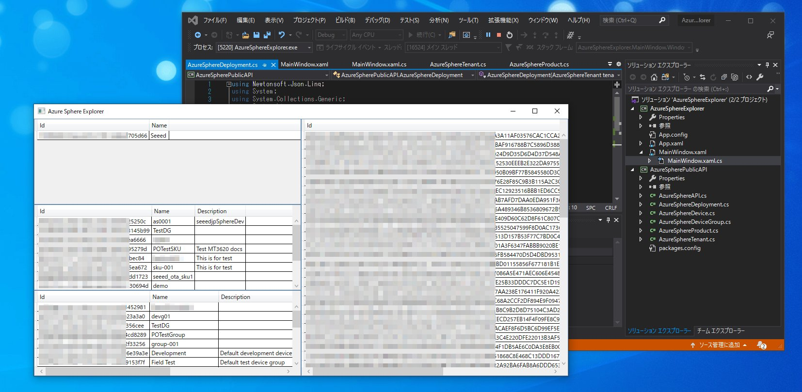

Azure Sphere Explorer
=

[-> Japanese](README.ja.md)

Azure Sphere Explorer is a GUI tool for managing Azure Sphere.  
You can quickly and easily see devices, products and device groups of the azure sphere.

The development of this tool has only just started.  
Please post your ideas and/or issues to GitHub issues page.

I am just starting to develop it.

If you are interested, click the Star button. Motivation to develop! :-)

## Screenshot

## Requirement

### Supported Platforms

* Microsoft Windows 10

## Licence

[MIT](LICENSE.txt)
